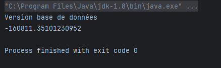
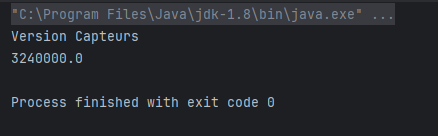

<h1>Mini Projet : Framework Injection des dépendances </h1>

<h2>Enoncé :</h2>

<h1>Développer un mini Framework d'injection de dépendances</h1>
    
Ce document présente les objectifs et les fonctionnalités d'un mini Framework d'injection de dépendances.

    <h2>Objectifs</h2>
    <ul>
        <li>Concevoir et créer un mini Framework d'injection de dépendances similaire à Spring IOC.</li>
        <li>Permettre aux programmeurs d'injecter des dépendances entre les différents composants de leur application.</li>
    </ul>
    <h2>Fonctionnalités</h2>
    <ul>
        <li>Injection de dépendances via un fichier XML de configuration utilisant Jax Binding (OXM).</li>
        <li>Injection de dépendances via des annotations.</li>
        <li>Possibilité d'injection par :
            <ul>
                <li>Le constructeur</li>
                <li>Le Setter</li>
                <li>Attribut (accès direct à l'attribut : Field)</li>
            </ul>
        </li>
    </ul>

<h2>version XML</h2>

<h3>Le fichier dependencies.xml : </h3>

 

     <?xml version="1.0" encoding="UTF-8"?>
     <injections>
         <injection id="dao" className="dao.IDaoImpl" />
         <injection id="metier" className="metier.IMetierImpl">
             <property name="dao" ref="dao" />
         </injection>
     </injections>

 
 

  

<h3>Injections class : </h3> 

 

    package xmlVersion;

    import javax.xml.bind.annotation.XmlElement;
    import javax.xml.bind.annotation.XmlRootElement;
    import java.util.List;
    
    @XmlRootElement(name = "injections")
    public class Injections {
    @XmlElement(name = "injection")
    List<Injection> injections;
    }

 
 

  

 <h3>Injection class : </h3> 

 

    package xmlVersion;

    import javax.xml.bind.annotation.XmlAttribute;
    import javax.xml.bind.annotation.XmlElement;
    import java.util.List;
    
    public class Injection {
    @XmlAttribute
    String id;
    
        @XmlAttribute(name = "className")
        String className;
    
        @XmlElement(name = "property")
        List<Property> properties;
    }

 
 

  

 <h3>Property class : </h3> 

 

    package xmlVersion;
    
    import javax.xml.bind.annotation.XmlAttribute;
    
    public class Property {
    @XmlAttribute
    String name;
    
        @XmlAttribute
        String ref;
    }

 
 

  

 <h3>DependencyInjector class : </h3> 

 
 
    
    package xmlVersion;
    
    import javax.xml.bind.JAXBContext;
    import javax.xml.bind.Unmarshaller;
    import java.io.InputStream;
    import java.lang.reflect.Method;
    import java.util.HashMap;
    import java.util.Map;
    
    public class DependencyInjector {
    private Map<String, Object> instances = new HashMap<>();
    
        public DependencyInjector(String xmlFile) throws Exception {
            // Lire le fichier XML
            JAXBContext jaxbContext = JAXBContext.newInstance(Injections.class);
            Unmarshaller unmarshaller = jaxbContext.createUnmarshaller();
            InputStream xmlStream = this.getClass().getClassLoader().getResourceAsStream(xmlFile);
            Injections injections = (Injections) unmarshaller.unmarshal(xmlStream);
    
            // Créer des instances et les stocker dans le map
            for (Injection injection : injections.injections) {
                Class<?> clazz = Class.forName(injection.className);
                Object instance = clazz.getDeclaredConstructor().newInstance();
                instances.put(injection.id, instance);
            }
    
            // Injecter les dépendances
            for (Injection injection : injections.injections) {
                if (injection.properties != null) {
                    for (Property property : injection.properties) {
                        Object instance = instances.get(injection.id);
                        Object dependency = instances.get(property.ref);
                        Method setter = instance.getClass().getMethod("set" + property.name.substring(0, 1).toUpperCase() + property.name.substring(1), dependency.getClass().getInterfaces()[0]);
                        setter.invoke(instance, dependency);
                    }
                }
            }
        }
    
        public Object getBean(String id) {
            return instances.get(id);
        }
    }

 
 

<h3> Main : </h3> 

 

    package presentation;
    
    import metier.IMetier;
    import xmlVersion.DependencyInjector;
    
    public class PresentationXMLVersion {
    public static void main(String[] args) throws Exception {
    DependencyInjector context = new DependencyInjector("dependencies.xml");
    IMetier metier = (IMetier) context.getBean("metier");
    System.out.println(metier.calcul());
    }
    }

 
 

<h3>Exécution : </h3>

<h2>version Annotations</h2>

<h3> Autowired : </h3>

    package framework;
    
    
    import java.lang.annotation.*;
    
    @Retention(RetentionPolicy.RUNTIME)
    @Target({ElementType.METHOD, ElementType.CONSTRUCTOR, ElementType.FIELD})
    public @interface Autowired {
    }

<h3> Component : </h3>

    package framework;
    
    
    import java.lang.annotation.*;
    
    @Retention(RetentionPolicy.RUNTIME)
    @Target(ElementType.TYPE)
    public @interface Component {
    String value() default "";
    }

<h3> Qualifier : </h3>

    package framework;
    
    import java.lang.annotation.*;
    
    @Retention(RetentionPolicy.RUNTIME)
    @Target({ ElementType.FIELD, ElementType.METHOD, ElementType.CONSTRUCTOR })
    public @interface Qualifier {
    String value();
    }

<h3> MyFramework Class : </h3>

    package framework;
    
    import org.reflections.Reflections;
    import org.reflections.scanners.SubTypesScanner;
    import org.reflections.scanners.TypeAnnotationsScanner;
    import org.reflections.util.ClasspathHelper;
    import org.reflections.util.ConfigurationBuilder;
    
    import java.lang.reflect.Constructor;
    import java.lang.reflect.Field;
    import java.lang.reflect.Method;
    import java.lang.reflect.Parameter;
    import java.util.HashMap;
    import java.util.Map;
    import java.util.Set;
    
    public class MyFramework {
    private Map<String, Object> beans = new HashMap<>();
    
        public MyFramework(String basePackage) throws Exception {
            // Parcourir toutes les classes du package
            Reflections reflections = new Reflections(new ConfigurationBuilder()
                    .setUrls(ClasspathHelper.forPackage(basePackage))
                    .setScanners(new SubTypesScanner(), new TypeAnnotationsScanner()));
            Set<Class<?>> classes = reflections.getTypesAnnotatedWith(Component.class);
    
            // Créer des instances pour les classes annotées avec @Component
            for (Class<?> clazz : classes) {
                Component component = clazz.getAnnotation(Component.class);
                String beanName = !component.value().isEmpty() ? component.value() : clazz.getName();
                Object instance = clazz.getDeclaredConstructor().newInstance();
                beans.put(beanName, instance);
            }
    
            // Injecter les dépendances
            for (Object bean : beans.values()) {
                for (Field field : bean.getClass().getDeclaredFields()) {
                    if (field.isAnnotationPresent(Autowired.class)) {
                        Object dependency = beans.get(field.getType().getName());
                        if (field.isAnnotationPresent(Qualifier.class)) {
                            Qualifier qualifier = field.getAnnotation(Qualifier.class);
                            dependency = beans.get(qualifier.value());
                        }
                        field.setAccessible(true);
                        field.set(bean, dependency);
                    }
                }
    
                for (Method method : bean.getClass().getDeclaredMethods()) {
                    if (method.isAnnotationPresent(Autowired.class) && method.getName().startsWith("set")) {
                        Object dependency = beans.get(method.getParameterTypes()[0].getName());
                        if (method.isAnnotationPresent(Qualifier.class)) {
                            Qualifier qualifier = method.getAnnotation(Qualifier.class);
                            dependency = beans.get(qualifier.value());
                        }
                        method.invoke(bean, dependency);
                    }
                }
    
                for (Constructor<?> constructor : bean.getClass().getConstructors()) {
                    if (constructor.isAnnotationPresent(Autowired.class)) {
                        Object[] dependencies = new Object[constructor.getParameterCount()];
                        Parameter[] parameters = constructor.getParameters();
                        for (int i = 0; i < parameters.length; i++) {
                            Object dependency = beans.get(parameters[i].getType().getName());
                            if (parameters[i].isAnnotationPresent(Qualifier.class)) {
                                Qualifier qualifier = parameters[i].getAnnotation(Qualifier.class);
                                dependency = beans.get(qualifier.value());
                            }
                            dependencies[i] = dependency;
                        }
                        constructor.setAccessible(true);
                        constructor.newInstance(dependencies);
                    }
                }
            }
        }
    
        public Object getBean(String name) {
            return beans.get(name);
        }
    }

<h3>Exécution : </h3>
